# Predicting students who will dropout
*Using machine learning to create an early warning system of predicted dropouts*

*Programmed in R*

## Getting Started


<div class="navbar navbar-default navbar-fixed-top" id="logo">
<div class="container">

</div>
</div>

### Objective

In this guide, you will be able to use techniques in machine learning to tune, 
fit, and use a model that predicts likely dropouts in a school system.

### Using this Guide

This guide utilizes synthetically-generated data, designed to roughly match data
put out by the state of Kentucky. However, it can be modified to fit data from 
any education context.

Once you have identified analyses that you want to try to replicate or modify, 
click the "Download" buttons to download R code and sample data. You can make 
changes to the charts using the code and sample data, or modify the code to 
work with your own data. If you are familiar with Github, you can click "Go 
to Repository" and clone the entire repository to your own computer. 

Go to the Participate page to read about more ways to engage with the OpenSDP 
community or reach out for assistance in adapting this code for your specific 
context.

### About the Data

The synthetically-generated data used in the guide mimics a 2015 dataset 
tracking the academic progress of Kentucky students who matriculated to 
the 9th grade in 2008. Its rows are student-level, and it contains many 
features. However, we are assuming that the state of "Faketucky" would 
only be using certain features to predict future dropouts. Here are the 
relevant predictor features (and outcome feature) that we retain from 
the dataset for model fitting and analysis: 

| Feature name          | Feature Description                                                                 |
|:------           |:-----------------------------------------                                                                       |
| `dropout`             | Outcome indicator: "0" if did not dropout of high school, 1 if did                  |
| `male`                | Indicator: "0" if female, "1" if male                                               |
| `race_ethnicity`      | Categorical: student race-ethnicity                                                 |
| `scale_score_8_math`  | Numeric: 8th grade standardized math exam scale score                               |
| `scale_score_8_read`  | Numeric: 8th grade standardized reading exam scale score                            |
| `gifted_11`           | Indicator: "0" if not enrolled in gifted program in 11th grade, "1" if enrolled     |
| `ever_alt_sch_11`     | Indicator: "0" if never in alternative school by 11th grade, "1" if ever enrolled   |
| `sped_11`             | Indicator: "0" if not enrolled in special education in 11th grade, "1" if enrolled  |
| `pct_absent_11`       | Numeric: Percent of school days absent in 11th grade                                |
| `cum_gpa_11`          | Numeric: Cumulative GPA in 11th grade                                               |
| `frpl_11`             | Indicator: "0" if not enrolled in free or reduced lunch program in 11th grade, "1" if enrolled |
| `lep_11`              | Indicator: "0" if not enrolled in limited English proficiency program in 11th grade, "1" if enrolled |

A manual with a full description of the data can be found in the `man` folder of the GitHub repository.

## Introduction

This guide demonstrates an introductory machine learning approach to 
developing a model for predicting if a student will drop out of high school.
Such models can provide "early warning systems" for students identified as
likely to dropout, allowing policymakers to develop interventions that target
those students.

In this scenario, we are developing a predictive dropout model for the state
of Faketucky. The state would like a model that takes as input student-level
measurements of the features described in the table above and outputs a prediction
of whether or not the student will drop out of high school. The state's thinking
is that if it can identify likely dropouts using data collected early in a student's
middle and high school career, it can introduce targeted interventions to prevent
those students from dropping out. However, these interventions are costly and cannot
be given to most students. To make the benefits outweigh the costs, the model must
not only accurately predict who will drop out, but it also must avoid "false alarms", i.e.,
identifying students as targets for intervention who would not have dropped out anyway.

This is a standard binary classification problem: we are predicting if a student will
fall into one category (a dropout) or its opposite (a non-dropout). The student must
fall within one of those two categories. There are many techniques one could use to
do such a prediction, some more complex than others. (Many of the best
predictive analytics packages are written in the R programming language.) Here, we 
demonstrate how to do a type of modified logistic regression: a Lasso regression. 
We chose the Lasso because it lends itself to demonstration of several key concepts
in machine learning, particularly the idea of "overfitting". It also based on a 
more commonly-known technique: logistic regression. However, many types of models can
be fitted and used to make predictions within the framework provided by this guide, 
particularly in the cross-validation section. 

Here are the steps:

1. explore the data, especially looking for missing data and skewed variables
2. split data between a train and test set
3. process training data based on exploration, to prepare for fitting
4. use cross-validation to train the parameters of the Lasso model
6. process the testing data (based on processing of training data)
7. generate an ROC curve from test set predictions and determine cutpoint
8. report expected accuracies of final model on out-of-sample data

## Setup

To prepare for this project you will need to ensure that your R installation 
has the necessary add-on packages and that you can read in the dataset. 


```r
# Install add-on packages needed
install.packages("dplyr") # this will update your installed version to align with 
install.packages("pROC") # those in the tutorial 
install.packages("devtools")
install.packages("glmnet")
install.packages("gmodels")
install.packages("elasticnet")
install.packages("plotROC")
```

Now we call the packages we need and we read in our full dataset, as well as some
helper functions.


```r
# Load the packages you need
library(dplyr)
library(pROC)
library(devtools)
library(elasticnet)
library(plotROC)
library(caret)
library(glmnet)
library(gmodels)


# Load the helper functions not in packages
source("../R/helper_funcs.R")

# Read in the data
# This command assumes that the data is in a folder called data, below your 
# current working directory. You can check your working directory with the 
# getwd() command, and you can set your working directory using the RStudio 
# environment, or the setwd() command.

data <- read.csv("../data/training_2009.csv", stringsAsFactors = FALSE)
```

### Validate the data

Ensure that the data imported correctly by checking that the data
is unique by student ID.


```r
nrow(data) == n_distinct(data$sid)
```

```
[1] TRUE
```

Faketucky wants the model to based only on certain predictors and, of
course, the outcome variable. We will select for just those predictors and
the outcome variable here:


```r
#Features to be retained in dataset
features <- c("dropout",
              "male",
              "race_ethnicity",
              "scale_score_8_math",
              "scale_score_8_read",
              "gifted_11",
              "ever_alt_sch_11",
              "sped_11",
              "pct_absent_11",
              "cum_gpa_11",
              "frpl_11",
              "lep_11")

#Selects features
data <- data[, features]

#Shows dimensions of data
dim(data)
```

```
[1] 52942    12
```

Note that we have more than 52,000 student records in this dataset. A lot
of data is required for making accurate preidiction models and a dataset
of this size should be enough to build a quality model and to test its
effectiveness.

## Explore the Data

### The outcome 

Let's look at the variable we are trying to predict--or the "outcome" variable. We create tables to show the distribution of students marked dropouts and students not marked dropouts.


```r
table(data$dropout, useNA = "always")
```

```

    0     1  <NA> 
43053  9889     0 
```

```r
round((table(data$dropout, useNA = "always")/nrow(data))*100,2)
```

```

    0     1  <NA> 
81.32 18.68  0.00 
```

About 19% of students are marked as dropouts. We will keep this in mind for our analyses,
as prediction models can sometimes be insensitive to predicting minority outcomes. There 
is no missing data for our outcome variable.

### Categorical features

Let's use a loop to investigate the distributions of our categorical predictors:


```r
#Loop over categorical feature names
for(i in c("male", "race_ethnicity", "frpl_11", "sped_11", "lep_11", 
           "gifted_11","ever_alt_sch_11")){
  
  #Print one-way table
  print(i)
  print(table(data[, i], useNA="always"))
  
}#End loop over feature names
```

We have 11 missing values for the gender indicator, 685 missing values 
for the race-ethnicity variable, and 684 missing values for the free/reduced 
lunch indicator. No other values are missing. Note that when we read the
data in, `race_ethnicity` contains blank values that are not marked as `NA` 
by R. Let's change that here:


```r
#Replace blanks with 'NA'
data$race_ethnicity[data$race_ethnicity == ""] <- NA
table(data$race_ethnicity, useNA = "always")
```

```

        African-American   Asian/Pacific Islander                 Hispanic 
                    6552                      674                     1709 
Multiple/Native American                    White                     <NA> 
                     940                    42382                      685 
```

Finally, we will make sure these categorical variables are classified as
factors in R, so that the program treats them as categorical (rather than
ordinal or numeric):


```r
#Vector of all factor variables
factors <- c("dropout","male","race_ethnicity","gifted_11",
             "ever_alt_sch_11","sped_11","frpl_11","gifted_11","lep_11")

#Store factor variables as factor in data
#Loop over feature names
for(variable in factors){
  
  #Store as factor
  data[, variable] <- as.factor(as.character(data[, variable]))
  
}# End loop over feature names
```

### Numeric features

Let's look at our continuous or ordinal predictor variables: 


```r
#Loop over numeric feature names
for(i in c("scale_score_8_math","scale_score_8_read","pct_absent_11", "cum_gpa_11")){
  
  print(i)
  print(summary(data[, i])) #Print summary for feature
  
}#End loop over numeric features
```

```
[1] "scale_score_8_math"
   Min. 1st Qu.  Median    Mean 3rd Qu.    Max.    NA's 
   0.00   26.00   42.00   41.36   57.00  183.00    8989 
[1] "scale_score_8_read"
   Min. 1st Qu.  Median    Mean 3rd Qu.    Max.    NA's 
   0.00   37.00   47.00   47.46   58.00  177.00    8975 
[1] "pct_absent_11"
    Min.  1st Qu.   Median     Mean  3rd Qu.     Max.     NA's 
   0.000    3.189    6.079    8.437   10.794 3153.000       87 
[1] "cum_gpa_11"
   Min. 1st Qu.  Median    Mean 3rd Qu.    Max.    NA's 
  0.000   2.044   2.694   2.631   3.307   4.000    1222 
```

Each variable contains missing values: the reading and math scores have 
particularly high rates of missingness, with close to 9,000 missing values. 
We also see very high outliers--impossibly high--for all variables besides 
GPA. Let's truncate those by turning them into missing values. Then we'll 
visualize the distributions for each as a histogram:


```r
#Loop over numeric feature names
for(i in c("scale_score_8_math","scale_score_8_read","pct_absent_11","cum_gpa_11")){
  
  data[,i][data[,i] > 100] <- NA #Truncate impossibly high values
  hist(data[, i], main=i) #Visualize as histogram
  
}#End loop over feature names
```

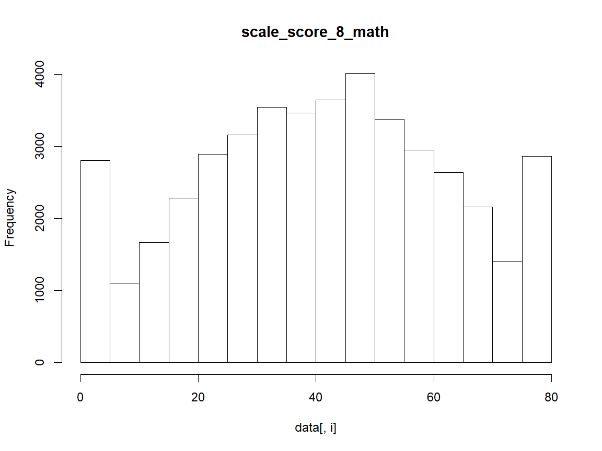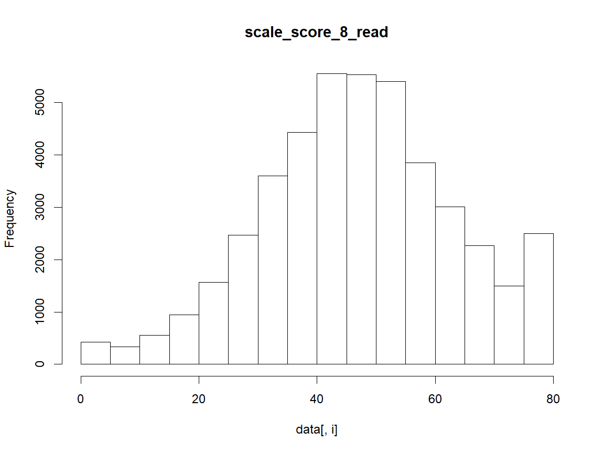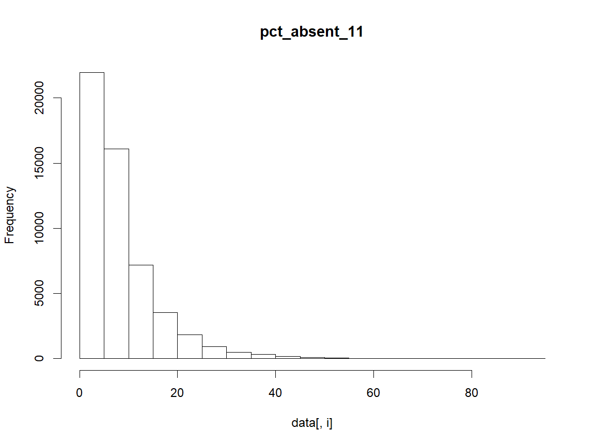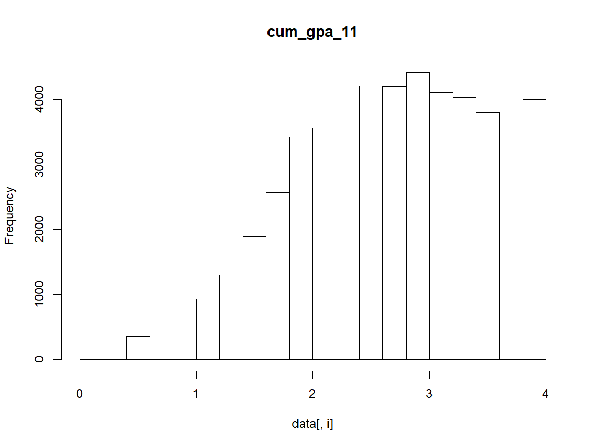

We see very heavy right skew for percent absent. This makes 
sense, as most students will miss below about 20% of school days.
However, there will be some students who miss much more often, resulting
in high outliers. Cumulative GPA shows left skew, which is also typical:
most students will earn passing grades in a majority of their classes, but
some will have higher failure rates, thus the outliers are on the lower (left)
end of the distribution. The exam score distributions are fairly symmetric.

For many prediction models, working with normally distributed (or 
aproximately normal) variables can help prediction power. In the next section,
we transform the skewed varaibles to make them more symmetric.

### Transformations

Let's start with transforming the right-skewed distribution of 
percent of days absent. The goal is to make this distribution appear
more normal or symmetric. One common strategy is to take the logarithm
of each data point. The value of the logarithm of an extremely high number 
will be considerably less than the original value, whereas the difference 
between the value of a low number and its logarithm is relatively lower in 
magnitude. Thus, while preserving the order of the datapoints, the logarithm
of a right-skewed distribution with produce lower values for high outliers, 
making the shape more symmetric. We show the logiarthm transformation of the 
percent absent data feature here:


```r
# // Investigate transformations
#Visualize log transformation of percent absences
hist(log(data$pct_absent_11))
```

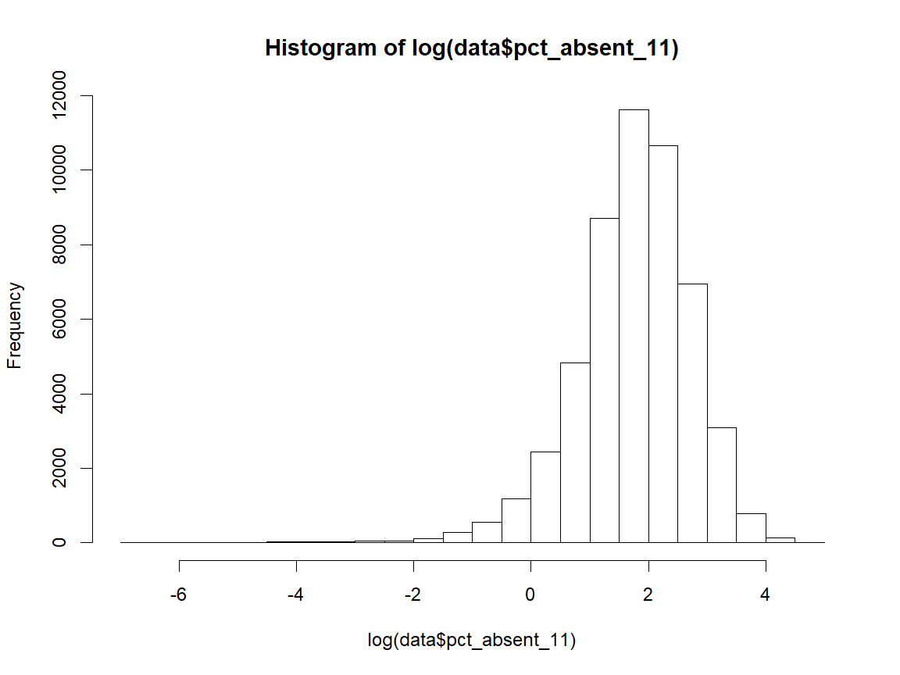

Note that it was transformed it too much, making it a left-skewed distribution. 
The log transformation, in other words, was too powerful. Moreover, if we found an 
out-of-sample student with perfect attendance, the log transformation would not work,
since the logarithm of zero is undefined. A more moderate transformation would be 
raising the data to a power below 1. We will try raising the data to the power of 0.5, 
also known as the square root transformation, and to the power of 0.25.


```r
# // Investigate transformations
#Visualize square root transformation
hist(sqrt(data$pct_absent_11))
```

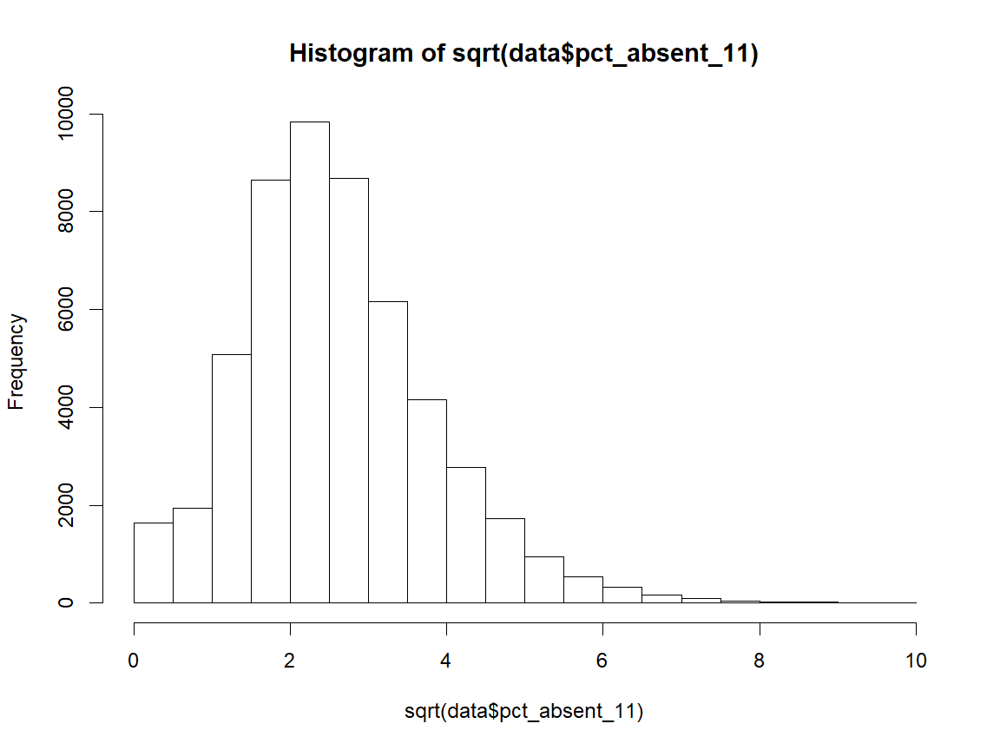

```r
#Visualize transformation of (1/4) power
hist(data$pct_absent_11^0.25)
```

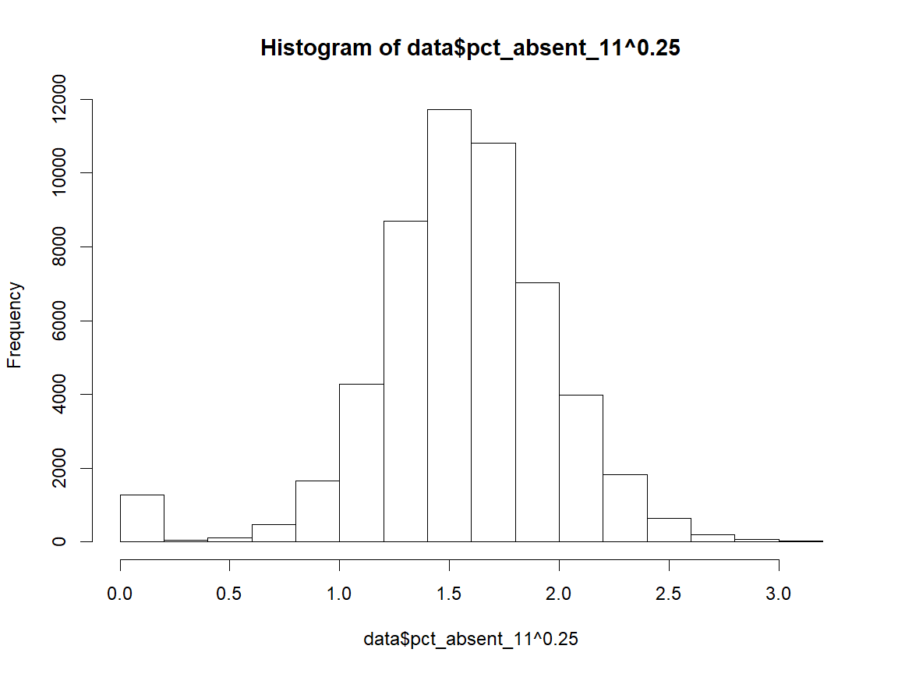

The square root transformation is not powerful enough, but the second 
transformation--raising to the power of 0.25--does the trick. The data looks 
a lot more normal. Thus, we save the data transformed by that power.


```r
#Store transformed data
data$pct_absent_11 <- data$pct_absent_11^0.25
```

Now let's transform the left-skewed distribution. To transform a 
left-skewed distribution, often squaring the values is a good solution. 
Because GPA is non-negative, the order will be preserved even if we 
square the values.


```r
#Visualize square root transformation
hist(data$cum_gpa_11^2)
```

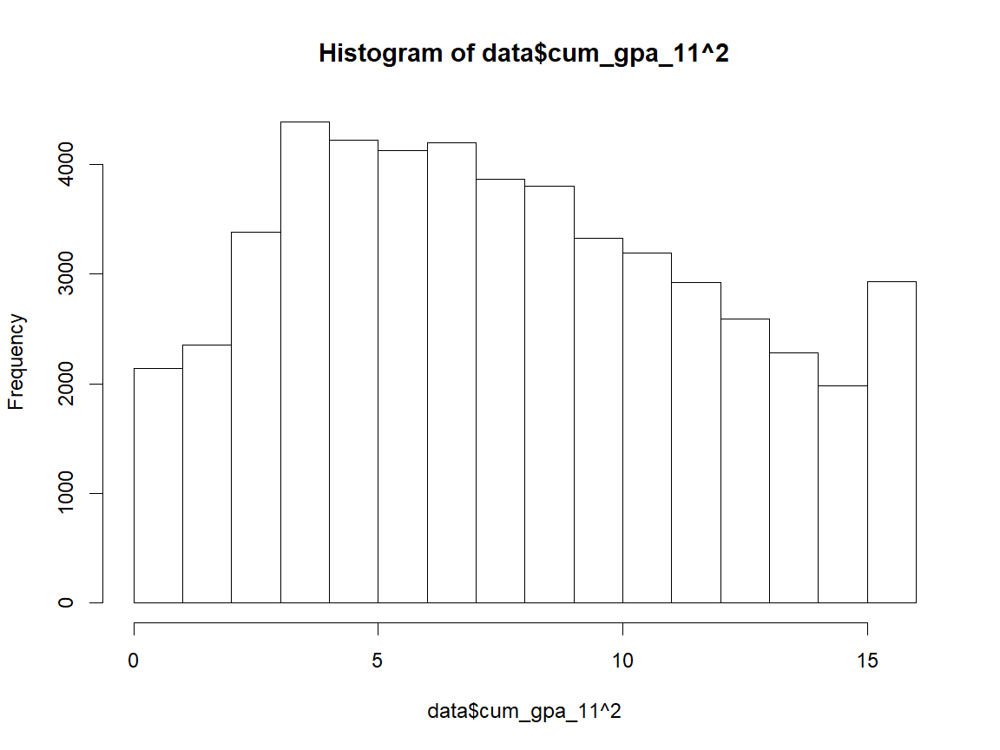

Although not necessarily normal, the distribution at least appears more 
symmetric now, which will help in our modeling. We store this 
transformed version of the variable.


```r
#Store transformed data
data$cum_gpa_11 <- data$cum_gpa_11^2
```

## Train and Test

In predictive modeling, it is key to create a "test" set of data. 
The test set is data that is not used in the model fitting stage of the 
analysis. In other words, it is data that goes "unseen" by the model 
until we finalize our model. Then, you can "test" your model's predictive 
accuracy by using it to predict the outcomes on the previously unseen 
test set. It's accuracy on the test data provides an estimate of how 
accurate it would be in predicting outcomes for completely new data
(often called "out of sample" data).

The data that is used in the model fitting stage is called the "train" set, 
since it's the data that is used to train your model's parameters. A 
conventional way to split a dataset between train and test sets is to randomly 
choose 80% of the data points to be in the train set, and 20% of the data points 
to be in the test set. This means that the bulk of the information is being used 
to fit the model, which should lead to a more accurate model (think about an 
extreme case: a model that fits around only one data point will not be very 
predictive--the more data, usually, the better). Fewer data points are needed 
to provide an estimate of predictive accuracy, thus the test set is smaller.

Here, we split our data randomly between train and test sets:


```r
#Set seet
set.seed(1738)

#Create a vector of integers, which will be indeces for datasets
indeces <- rownames(data)

#Randomly sort these integers
indeces <- sample(indeces, size = length(indeces), replace = FALSE)

#Define number of data points for train set
n.train <- round(nrow(data)*0.8,0)

#Create train and test sets
train_data <- data[indeces[1:n.train],]
test_data <- data[indeces[(n.train+1):nrow(data)],]
rownames(train_data) <- NULL
rownames(test_data) <- NULL

#Show dimensions of both datasets
dim(train_data)
```

```
[1] 42354    12
```

```r
dim(test_data)
```

```
[1] 10588    12
```


## Data Processing

### Missing Values

Now let's look into handling the datasets missing value, specifically within
the training set.


```r
summary(train_data)
```

```
 dropout     male                        race_ethnicity  scale_score_8_math
 0:34434   0   :20367   African-American        : 5259   Min.   : 0.00     
 1: 7920   1   :21977   Asian/Pacific Islander  :  540   1st Qu.:26.00     
           NA's:   10   Hispanic                : 1362   Median :42.00     
                        Multiple/Native American:  765   Mean   :41.32     
                        White                   :33864   3rd Qu.:57.00     
                        NA's                    :  564   Max.   :80.00     
                                                         NA's   :7197      
 scale_score_8_read gifted_11 ever_alt_sch_11 sped_11   pct_absent_11  
 Min.   : 0.00      0:34307   0:30682         0:37529   Min.   :0.000  
 1st Qu.:37.00      1: 8047   1:11672         1: 4825   1st Qu.:1.338  
 Median :47.00                                          Median :1.572  
 Mean   :47.43                                          Mean   :1.557  
 3rd Qu.:58.00                                          3rd Qu.:1.814  
 Max.   :80.00                                          Max.   :3.117  
 NA's   :7213                                           NA's   :81     
   cum_gpa_11     frpl_11      lep_11   
 Min.   : 0.000   0   :16502   0:41683  
 1st Qu.: 4.170   1   :25292   1:  671  
 Median : 7.244   NA's:  560            
 Mean   : 7.637                         
 3rd Qu.:10.912                         
 Max.   :16.000                         
 NA's   :969                            
```

It looks like we have missing values for gender, race-ethnicity, 8th grade 
math exam score, 8th grade reading exam score, percent absent, cumulative 
GPA, and free and reduced lunch status. Various imputation and missing 
data handling methods exist, and best practices in machine learning for 
missing data is still an area of active research. 

One simple and computationally efficient way to handle missing data is to 
impute values of central tendency or commonality. For example, for 
continuous variables we would replace the missing values with simply the 
mean of the values for that feature. For categorical variables, we would 
impute the mode. 

However, in the context of predicting dropouts, missing values can hold 
key information. Students who move from home-to-home, switch from school-to-school, 
or miss a lot of school often may have data missing from their file in 
education databases. In addition, the factors that cause a student to have 
missing data may also be good predictors of whether or not that student 
is likely to dropout of school. If we use a simple imputation method to 
get rid of missing values, we could lose that key information. Our final 
model, therefore, would be less accurate in its predictions.

To explore the amount of predictive information a missing value may provide, 
we will run a simple logistic regression on our training dataset. Logistic 
regression provides us an elementary model for binary classification, in 
which we can make a preliminary judgement of the power of each predictor. 
We will create indicator values for missingness, which will become additional 
predictors in our logistic regression model. For example, we will create 
a variable that reads "1" if the student has missing data for their 
8th grade math test, and "0" if the data is present. Then, the size 
of the coefficient for this indicator from our logistic regression 
will tell us if adding this extra variable has a chance to add any predictive 
power to our final model.

We implement this below:


```r
#All our features with missing data
missing.features <-   c("male",
                        "race_ethnicity",
                        "scale_score_8_math",
                        "scale_score_8_read",
                        "pct_absent_11",
                        "cum_gpa_11",
                        "frpl_11")

#Stores copy of our training data
data.miss <- train_data

#Loop over features with missing values
for(feature in missing.features){
  
  #Create and attach indicator of missing value
  data.miss[, paste("miss",feature)] <- as.factor(
                                          ifelse(
                                            complete.cases(data.miss[,feature]),
                                                         0,
                                                         1))
  
}#End loop over features with missing values

#Impute missing values to run logistic regression
#Loop over all features
for(feature in colnames(data.miss)){
  
  #If feature is a factor variable
  if(class(data.miss[,feature]) == "factor"){
    
    #Impute the mode for missing values (use helper functino 'Mode')
    data.miss[is.na(data.miss[,feature]) ,feature] <- Mode(data.miss[,feature])
    
  }#End if conditional 
  
  else{
    
    #If non-factor, impute the mean
    data.miss[is.na(data.miss[,feature]) ,feature] <- mean(data.miss[,feature], na.rm = T)
    
  }#End else conditional
  
}#End loop over features

#Fit logistic regression model and summarize
logit <- glm(dropout ~ . , data = data.miss, family = "binomial")
summary(logit)$coef[,c(1,4)]
```

```
                                            Estimate      Pr(>|z|)
(Intercept)                            -2.0785159598  5.138930e-90
male1                                   0.0473974462  1.236109e-01
race_ethnicityAsian/Pacific Islander    0.0213412217  8.705389e-01
race_ethnicityHispanic                 -0.0419025509  6.239212e-01
race_ethnicityMultiple/Native American -0.2756018395  1.423364e-02
race_ethnicityWhite                    -0.2330731326  7.547697e-09
scale_score_8_math                     -0.0041762928  6.620958e-04
scale_score_8_read                      0.0003988659  7.875169e-01
gifted_111                              0.1121609414  2.602652e-02
ever_alt_sch_111                        0.4563627927  5.633540e-51
sped_111                               -0.0320475556  4.537102e-01
pct_absent_11                           1.1166835961 8.852668e-179
cum_gpa_11                             -0.2325726290  0.000000e+00
frpl_111                                0.0299472763  3.800279e-01
lep_111                                 0.0738944114  4.991299e-01
`miss male`1                            0.5170189288  5.487811e-01
`miss race_ethnicity`1                  0.2999072716  1.022521e-02
`miss scale_score_8_math`1              0.4318332747  7.294081e-10
`miss scale_score_8_read`1              0.5966824590  3.212148e-18
`miss pct_absent_11`1                   0.8116263394  3.897816e-03
`miss cum_gpa_11`1                      2.5748973302 4.416506e-193
`miss frpl_11`1                        -0.1298668509  2.396553e-01
```

In our basic logistic regression model, some of our most powerful 
predictors are the missingness indicators we added to the dataset, 
including the indicators for missing values in GPA, 8th grade math 
scores, 8th grade reading scores, and percent attendance. This shows
that the missingness contains key information that could help our
final model with predictions.

The gender and race-ethnicity predictors had a relatively low number 
of missing values. The predictive strength of their indicators is 
also relatively low, in our basic logistic regression. Even though 
the free and reduced lunch variable had a more moderate number 
of missing vlaues, the inclusion of a missingness indicator 
did not add much predictive power to our basic model.

Since the indicators of missing values for GPA, 8th grade math 
scores, 8th grade reading scores, and percent attendance were 
particularly powerful, we will add these indicators to our 
training and testing datasets. Hopefully, their inclusion 
will give our final model more information and therefore, make 
it more powerful. As done in our basic logistic regression model, 
all missing values will be given a mean or mode imputation, 
allowing us to be computationally efficient and to prevent 
cutting students from our model fitting or predictions.

Note: adding too many predictors to a prediction model can lead to
overfitting and worse prediction accuracy on out-of-sample data.
We will account for this convern during the model fitting stage,
in the cross validation section.


```r
#All our features that will get a missingness indicator
miss.ind.features <-   c("scale_score_8_math",
                        "scale_score_8_read",
                        "pct_absent_11",
                        "cum_gpa_11")

#Loop over features to include missing indicators for
for(feature in miss.ind.features){
  
  #Create and attach indicator of missing value
  train_data[, paste("miss",feature,sep="")] <- as.factor(
                                                ifelse(
                                                  complete.cases(train_data[,feature]),
                                                         0,
                                                         1))
  
}#End loop over features 

#Impute missing values
#Loop over all features
for(feature in colnames(train_data)){
  
  #If feature is a factor variable
  if(class(train_data[,feature]) == "factor"){
    
    #Impute the mode for missing values
    train_data[is.na(train_data[,feature]) ,feature] <- Mode(train_data[,feature])
    
  }#End if conditional 
  
  else{
    
    #If non-factor, impute the mean
    train_data[is.na(train_data[,feature]) ,feature] <- mean(train_data[,feature], 
                                                            na.rm = T)
    
  }#End else conditional
  
}#End loop over features

#Check if any NAs left
summary(train_data)
```

```
 dropout   male                       race_ethnicity  scale_score_8_math
 0:34434   0:20367   African-American        : 5259   Min.   : 0.00     
 1: 7920   1:21987   Asian/Pacific Islander  :  540   1st Qu.:29.00     
                     Hispanic                : 1362   Median :41.32     
                     Multiple/Native American:  765   Mean   :41.32     
                     White                   :34428   3rd Qu.:53.00     
                                                      Max.   :80.00     
 scale_score_8_read gifted_11 ever_alt_sch_11 sped_11   pct_absent_11  
 Min.   : 0.00      0:34307   0:30682         0:37529   Min.   :0.000  
 1st Qu.:39.00      1: 8047   1:11672         1: 4825   1st Qu.:1.339  
 Median :47.43                                          Median :1.571  
 Mean   :47.43                                          Mean   :1.557  
 3rd Qu.:55.00                                          3rd Qu.:1.813  
 Max.   :80.00                                          Max.   :3.117  
   cum_gpa_11     frpl_11   lep_11    missscale_score_8_math
 Min.   : 0.000   0:16502   0:41683   0:35157               
 1st Qu.: 4.240   1:25852   1:  671   1: 7197               
 Median : 7.408                                             
 Mean   : 7.637                                             
 3rd Qu.:10.815                                             
 Max.   :16.000                                             
 missscale_score_8_read misspct_absent_11 misscum_gpa_11
 0:35141                0:42273           0:41385       
 1: 7213                1:   81           1:  969       
                                                        
                                                        
                                                        
                                                        
```

### Polynomial Terms

Sometimes, the outcome from a model may vary linearly with
the predictors. Other times, the variation may have a quadratic
or higher-order polynomial relationship. Adding polynomial transformations
of our predictor variables can help better capture this relationship and
could lead to better predictions from the model. 

Again, note: adding too many predictors to a prediction model can lead to
overfitting and worse prediction accuracy on out-of-sample data.
We will account for this convern during the model fitting stage,
in the cross validation section.

Here, we attach additional polynomial transformed features to our
dataset:


```r
# // Create polynomial terms
#Loop over feature names
for(variable in c("scale_score_8_math","scale_score_8_read","pct_absent_11","cum_gpa_11")){
  
  #Create new column with feature raised to certain power in train set
  train_data[, paste(variable,"^2",sep="")] <- train_data[, variable]^2
  train_data[, paste(variable,"^3",sep="")] <- train_data[, variable]^3
  
}# End loop over feature names
```

### Standardize and Center

Finally, we will standardize our numeric predictors to have a standard
deviation of one and center them at zero. Doing so helps with rounding 
considerations and reduces the chance of collinearity between predictors.

The `caret` package has multiple functions that help with the typical
steps involved in machine learning. Here, the package's `preProcess` function
will allow us to standardize and center our predictors in just two lines.
The function finds the standard deviation and mean for each predictor.
Next, it subtracts each observation by the mean (centering it at zero)
and then divides each value by the standard deviation (to standardize
it).


```r
#Stores objection with informatoin on centering and scaling numeric data
processor <- preProcess(train_data, method = c("center","scale"))

#Centers and scales our training numberic data
train_data_s <- predict(processor, train_data)
```


## Cross-Validation and Model Fit

### Overfitting: An Example

The most important stage of the predictive modeling process is 
cross-validation. Let's go through a simple example to elucidate why:

Say you are running a simple regression. There is one predictor 
variable, X, and there is one outcome variable, Y. Below, we visualize three
possible models one could use to predict Y given X:

<!--  -->

The three sample regression equations that produce these models are:

Left Panel: $Y = {\beta}_{0} + {\beta}_{1}X$

Middle Panel: $Y = {\beta}_{0} + {\beta}_{1}X + {\beta}_{2}X^{2}$

Right Panel: $Y = {\beta}_{0} + {\beta}_{1}X + {\beta}_{2}X^{2} + {\beta}_{3}X^{3} + {\beta}_{4}X^{4} + {\beta}_{5}X^{5}$

Let's evaluate the first, left-most model. This model is too simple,
as it tries to map a linear model to a clearly curved relation between
our X and Y values. If we had to predict new out-of-sample data from the 
same population, we wouldn't be confident in our predictions. Particularly
if we were to preict Y values from X values in the center of our distribution,
our predictions would generally be overestimates, so we see that this model 
is biased.

Another attempt we could make at modeling is to add a couple of polynomial predictors,
to better captured the curved trend we see in the data. This model is shown in the middle
panel. Although this model doesn't perfectly "connect the dots" in the given data, we can
be reasonably certain that it will provide relatively reasonable estimates on new
data. It assumes a polynomial shape to the data with some random noise around that 
shape. 

Why  not go for broke and try to perfectly model this data? We can do so by adding 
even more polynomial terms to our set of predictors. Let's look at the right-most 
panel. This model, which is our most complex in terms the number of predictors,
has no bias on the given data--it perfectly models each point. However, for new data,
we cannot be so confident this model will still "connect the dots." In fact, it will
most likely do a sub-optimal job at predicting new data, since its many twists and turns
are modeling random noise, rather than the underlying trend in the distribution. Unlike 
the first model, this model has low bias on our training data; however, because 
it models random noise, it has high variance, which will lead to sub-optimal 
predictions on out-of-sample data.

The left-most model is "underfit," meaning it has low variance but high bias--it is
not capturing the underlying trend in our data. Underfit models do a poor job modeling
the given training data, and they do a poor job predicting new out-of-sample data.
The right-most model is "overfit," meaning it has low bias but high variance--it is
attempting to systematically model the random noise in our given data. Overfit models
do an excellent job modeling our given training data, but they do a poor job predicting
new out-of-sample data. 

The goal in making a prediction model is to "tune" our model so that it is not underfit
or overfit. The Lasso provides a way to do this. 

### The Lasso's Penalty

The Lasso binary classification model is based on logistic regression. The danger with
using logistic regression for predicting new data is that we may overfit our model, by
either using too many predictors (as with the example above) or having Beta coefficient
values that are too high in magnitude--that are too strong. The Lasso has a built-in
"tuning parameter", $\lambda$, which acts as a penalty factor on our Betas. If a 
predictor's Beta value is so strong that it will start to cause our model to fit to noise,
it will reduce the Beta value. Or, if a certain feature doesn't really help our model
explain variation in the data enough, it will penalize the Beta to a value of 0, effectively
cutting out that predictor from our model completely.

The trick is that if we make the penalty factor, $\lambda$, too high, it will
penalize our Beta values too much and our model may underfit the data. If we set $\lambda$
too low, the penalty will not be great enough to prevent overfitting. So that begs the
question: how do we find the best possible value for $\lambda$?

### K-fold cross-validation

That is where cross-validation comes in. Here, we take you through K-fold cross-validation.
In K-fold cross validation, we cut our data into 'k' folds. For example, say we had 100
data points and we wanted to do k = 5 folds. We take our data and slice it into 5 equal
portions (so 20 data points in each portion). Then, for a certain value of $\lambda$, 
we fit a Lasso model on the first four portions of the data. The last portion (the last 20
data points) is saved as a mock 'test set'. We see how well our model does in predicting 
values on this test set. We then delegate a different slice of the data to be the new test 
set, and we fit our model on the other four folds. We iterate this process five times 
until each slice of the data has been the test set at least once. Every time we iterate
through one of the k folds, we save the predicition accuracy of the model. Then we average
these accuracies to come up with a predicted accuracy for a model of that $\lambda$. By 
delegating a portion as a test set, this method allows us to estimate prediction accuracy on out-of-sampled data. We then do the above process for a set of $\lambda$ values we'd like
to try. The tuning parameter value that produces the best prediction accuracy in
cross-validation is the value we will use in our final model.

Here is pseudocode that succintly summarizes the structure of cross-validation:

```
for each tuning parameter value
  for each of the 'k' folds
    fit model (using parameter value) on training sets of fold
    test model prediction accuracy on test set fold
    store prediction accuracy in a vector
  take the average of the accuracy rates over 'k' folds
  store average accuracy rate for the parameter value
select the parameter value that produced the highest accuracy rate

```
Now we manually implement cross-validation on our own training data, using the Lasso.
Note that we are using functions from the `caret` package here to produce the k-folds,
and we are using `glmnet` to fit the Lasso model. 


```r
set.seed(4612)

#Creates matrix of covariates
X <- model.matrix(dropout ~ ., data = train_data)[,-1]

#5 fold cross validation
K <- 5

#Get indeces for folds
flds <- createFolds(y=train_data$dropout, 
                    k=K, list=TRUE, returnTrain=TRUE)
names(flds)[1] <- "training"

#Make range of parameters to test
powers <- seq(-7, 5, 0.25) # shorten the number of lambdas up
lambdas <- 10**powers

library(doFuture) # parallel processing
library(foreach) # parallel looping structure
registerDoFuture() # configure futures to work in R
# most computers have 4 cores and this will work across Mac and PC. If more cores 
# are available it can be made faster by increasing this number, but 4 is a good 
# default
plan("multiprocess", workers = 6) 

#Loop over all parameter options
lasso_results <- foreach(d = 1:length(lambdas), .combine = rbind) %dopar% {

 #Counts loop runs
  l <- lambdas[d]
 
 #Loop over K folds
 for(i in 1:K){

   accuracies <- vector(mode = "numeric", length=K)
  dropout.accuracies <- vector(mode = "numeric", length=K)

   #Sets indeces for values in folds
   train.index <- flds[[i]] #80% of data used in training
   test.index <- setdiff(rownames(train_data), flds[[i]]) #20% of data used to test

   #Select training covariates and outcomes
   X.train <- X[train.index,]
   out.train <- train_data[train.index, "dropout"]

   #Fit with lambda
   model <- glmnet(x = X.train,
                   y = out.train,
                   family = "binomial", alpha = 1, lambda = l)

   #Select test covariates and outcomes
   X.test <- X[test.index,]
   observed <- train_data[test.index, "dropout"]

   #Make predictions on test data
   probabilities <- predict(model, newx = X.test)
   predicted <- ifelse(probabilities > 0.81, 1, 0)

   # Model accuracy
   accuracies[i] <- mean(predicted == observed) #overall accuracy
   dropout.accuracies[i] <- mean(predicted[observed==1] == observed[observed==1])

 } #End loop over k folds

 #Average accuracies from all folds
 data.frame(lambda = l, 
             overall.accuracy = mean(accuracies), 
            dropout.accuracy = mean(dropout.accuracies))
  
                           }


##################################################
## We don't need to do this part in the loop
## It just adds extra cost to each cycle, we can 
## find best accuracy at the end
#################################################
# #See if new accuracy is best accuracy
#  if(new.accuracy > best.accuracy){
# 
#    #Stores as new best accuracy, and its parameter
#    best.accuracy <- new.accuracy
#    best.param <- lambdas[j]
#    best.accuracy.dropout <- new.drop.accuracy
# 
#  }#End conditional
# 
#  #See if new dropout accuracy is best dropout accuracy
#  if(new.drop.accuracy > best.dropout.accuracy){
# 
#    #Stores as new best dropout accuracy, and its parameter
#    best.dropout.accuracy <- new.drop.accuracy
#    best.dropout.param <- lambdas[j]
#    best.dropout.accuracy.overall <- new.accuracy
# 
#  }#End conditional

#End loop over hyperparameter
plan(sequential) # this cleans up any open R sessions as part of the parallel 
# computing

# TODO: Break this part up, put the accuracy and the dropout plots in separate 
## output chunks, put a little text between them
## Put the conclusion print out chunk after that. 


#Shows overall accuracy at different lambda values
lineplot.overall <- ggplot(lasso_results, aes(lambda))+
             geom_smooth(aes(y = overall.accuracy), color = "dodgerblue2")+
             scale_x_continuous(trans ='log10')


lineplot.overall
```

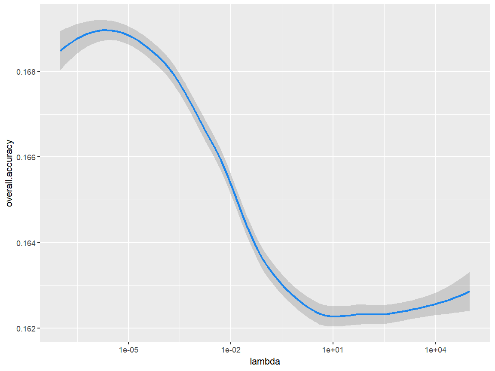

```r
#Shows dropout accuracy at different lambda values
lineplot.dropout <- ggplot(lasso_results, aes(lambda))+
             geom_smooth(aes(y = dropout.accuracy), color = "dodgerblue2")+
             scale_x_continuous(trans ='log10')

lineplot.dropout
```

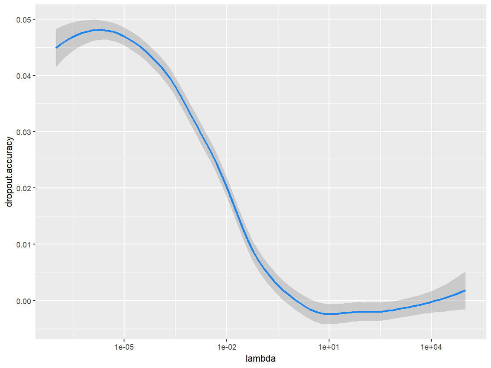


```r
# TODO: Finish this structure, a better way to organize CV results
# Should set this up as a data.frame structure
# Round the parameters before printing too


print(paste("Best overall accuracy:", max(lasso_results$overall.accuracy)))
```

```
[1] "Best overall accuracy: 0.168783943329398"
```

```r
print(paste("lambda for best overall accuracy:", 
            lasso_results$lambdas[lasso_results$overall.accuracy == 
                                    max(lasso_results$overall.accuracy)]))
```

```
[1] "lambda for best overall accuracy: "
```

```r
print(paste("Accuracy for dropout subgroup:", max(lasso_results$dropout.accuracy)))
```

```
[1] "Accuracy for dropout subgroup: 0.0464646464646465"
```

```r
cat('\n')
```

```r
print(paste("Best dropout accuracy:", max(lasso_results$dropout.accuracy)))
```

```
[1] "Best dropout accuracy: 0.0464646464646465"
```

```r
print(paste("lambda for best dropout accuracy:", 
             lasso_results$lambdas[lasso_results$dropout.accuracy == 
                                    max(lasso_results$dropout.accuracy)]))
```

```
[1] "lambda for best dropout accuracy: "
```

```r
#Not sure what this one is
#print(paste("Overall accuracy:",best.dropout.accuracy.overall))
```

Our cross-validation shows us the value of the Lasso's penalty 
factor, $\lambda$, that maximized prediction accuracy across the 5-fold 
test sets: . The accuracy this tuning parameter value 
produced was . This is a percent signifying 
that, among all the test set data points in cross-valdiation, our models 
predicted whether the student would or would not drop out correctly
percent of the time.


Above, we implemented the cross-validation manually, in order to show 
the structure of cross-validation, However, this is rarely done in 
practice. The `caret` package includes useful tools for training models 
via cross-validation. We demonstrate the same cross-validation process below, 
using functions from `caret`.


```r
#Set k for k-fold validation
K = 5

#Prepare outcome data as a factor with different level lables
train_data_car <- train_data_s
train_data_car$dropout <- as.factor(as.character(train_data_car$dropout))
levels(train_data_car$dropout) <- c("X0","X1")

#Set seed
set.seed(4612)

#Sets type of cross-validation in training fucntion
TC <- trainControl(method = "cv",
                   number = K, allowParallel = TRUE)

plan(multisession, workers = 6) # create parallel workers to speed things up
#Trains ands fits model using cross-validation
lasso.model <- train(dropout~., train_data_car, method = "glmnet",
                     tuneGrid = expand.grid(.alpha = 1,
                                             .lambda = 10**seq(-7,7, by = 0.1)),
                     trControl = TC,
                     metric = "Accuracy",
                     family = "binomial")
plan(sequential) # close out parallel workers
#Shows best tuning parameter in model
lasso.model$bestTune["lambda"]
```

```
         lambda
28 5.011872e-05
```

```r
#Shows performance of model
getTrainPerf(lasso.model)
```

```
  TrainAccuracy TrainKappa method
1     0.8581244   0.447894 glmnet
```

```r
#Shows coefficients in model
#coef(lasso.model$finalModel, lasso.model$bestTune$lambda)
```

### Unbalanced Classes

We could take our fairly high classification accuracy and call it a day.
However, overall classification accuracy is not the only metric that could 
be used to evaluate a predictive model's fit. In fact, in this case, it 
is a particularly poor metric.

Dropouts only compose about 19% of our dataset. If we naively predicted
that no students dropped out, our overall classification accuracy would be
81%. Although this accuracy rate seems fairly high, such a model would be
useless for the task of predicting future dropouts, since the model would 
classify all future dropouts as non-dropouts.

Our cross-validation was run trying to find the $\lambda$ value that maximized
overall classification accuracy. In doing so, we ran the danger of using a tuning
parameter value that would maximize overall accuracy, at the cost of predictive
power among future dropouts. We can tell from the output of the cross-validation
that our chosen model would do pretty horrendously in predicting future
dropouts: Among students in our training dataset who were labeled as a dropout, 
our 'best' model only predict percent of 
them to drop out.

We need to use a method other than overall classification accuracy, which takes into
account our classification goals. Our goals are two-fold: 

1. Maximize true positives: We want to classify, at high rates, 
future dropouts as 'dropouts.' If our model fails to identify future dropouts,
it has failed in its mission. Planned interventions will not reach the
students who need it.

2. Minimize false positives: We want to minimize, as much as possible,
instances in which a non-dropout is predicted to be a dropout by our model. 
Interventions for likely dropout students can be costly--if our model tells
policymakers to target students with dropout interventions and those students
are not students who otherwise would have dropped out, then we create costly 
inefficiency. 

### The ROC Curve

A metric that takes both of our goals into account is the receiver operating
characteristic, or the ROC. To understand the ROC, it helps to think through how
the Lasso, and classification models like it, make predictions.

The Lasso does not automatically output predictions. Rather, it outputs
probabilities. For example, our model may predict that a certain student's 
probability of dropping out is 40%. It's then up to the user to determine if we 
want to predict this person to be a dropout or a non-dropout. The probability
threshold at which we declare a "dropout" is known as the 'cutoff.'

If we set our cutoff low, then the criteria for our model to declare an observation
as a dropout is less strenuous. As a result, we will have a higher true positive 
rate. At the same time, we will make more mistakes, creating more false positives. 
By the same token, raising the cutoff creates fewer false positives, but it also creates
fewer true positives. This creates a continuum of true and false positive rates based
on cutoff values that is often visualized as the 'ROC curve'. Here is an example
of an ROC curve:


The labeled points on the curve are cutpoints. As the cutpoints decrease in value, the
true positive rate increases, as does the false positive rate. As the cutpoints increase
in value, the true positive rate decreases in value, as does the false positive rate. 
The goal of the model is to push this curve as far to the upper-left corner of the graph
as possible--to the area with high true positive rate and low false positive rate. So,
we want to perform a cross-validation to tune our $\lambda$ to the value that produces the 
best--the most shifted upwards and left--ROC curve. A way to distill the "best" ROC curve
is to take the area under the curve, also known as the 'AUC.' The higher the AUC, the more
shifted (and stretched) our ROC curve is to the upward-left corner of the graph. The highest
AUC model will have cutpoints that that produce the lowest false positive rates and highest
true positive rates. 

So, we will run another cross-validation, this time using AUC as the model evaluation
metric, rather than overall classification accuracy. Here is pseudocode for the process:

```
for each tuning parameter value
  for each of the 'k' folds
    fit model (using parameter value) on training sets of fold
    test model AUC on test set fold
    store AUC in a vector
  take the average of the AUC over 'k' folds
  store average AUC for the parameter value
select the parameter value that produced the highest average AUC

```
Note that this can be done again in the `caret` package, with slight modifications:

### Fitting with ROC


```r
#Set seed
set.seed(4612)

#Set k for k-fold validation
K = 5

#Gives function output and cross-validation tuning
TC <- trainControl(method = "cv",
                   number = K,
                   classProbs = TRUE,
                   savePredictions = TRUE,
                   allowParallel = TRUE,
                   summaryFunction = twoClassSummary)

plan(multisession, workers = 6)
#Trains model with method AUC
model.ROC <- train(dropout~., train_data_car, method = "glmnet",
              metric = "ROC",
              tuneGrid = expand.grid(.alpha = 1,
                                     .lambda = 10**seq(-7,7, by = 0.1)),
              trControl = TC)
plan(sequential)

#Best paramter chosen
model.ROC$bestTune["lambda"]
```

```
         lambda
28 5.011872e-05
```

```r
#Shows performance on subgroups and ROC
getTrainPerf(model.ROC)
```

```
   TrainROC TrainSens TrainSpec method
1 0.8395011 0.9589941 0.4195707 glmnet
```

```r
#Shows coefficients in model
coef(model.ROC$finalModel, model.ROC$bestTune$lambda)
```

```
27 x 1 sparse Matrix of class "dgCMatrix"
                                                  1
(Intercept)                            -2.218106479
male1                                   0.048992619
race_ethnicityAsian/Pacific Islander    0.117295891
race_ethnicityHispanic                  0.023699992
race_ethnicityMultiple/Native American -0.150309868
race_ethnicityWhite                    -0.108069156
scale_score_8_math                     -0.094440789
scale_score_8_read                     -0.018421728
gifted_111                              0.021485760
ever_alt_sch_111                        0.395370416
sped_111                               -0.008127414
pct_absent_11                          -0.138363477
cum_gpa_11                             -4.318735583
frpl_111                                0.052970101
lep_111                                 0.111121654
missscale_score_8_math1                 0.380430484
missscale_score_8_read1                 0.633226569
misspct_absent_111                      0.965998399
misscum_gpa_111                         2.330194078
`scale_score_8_math^2`                  .          
`scale_score_8_math^3`                  0.009519349
`scale_score_8_read^2`                  0.009180399
`scale_score_8_read^3`                  .          
`pct_absent_11^2`                       0.368145014
`pct_absent_11^3`                       0.221510882
`cum_gpa_11^2`                          6.789122804
`cum_gpa_11^3`                         -3.181483162
```

```r
#Get indeces for best model lambda
roc.index <- model.ROC$pred$lambda == model.ROC$bestTune[["lambda"]]

#Plot ROC curve for best model
ggplot(model.ROC$pred[roc.index, ], 
        aes(m = X1, d = factor(obs, levels = c("X0", "X1"))))+ 
        geom_roc(hjust = -0.4, 
                 vjust = 1.5, 
                 n.cuts = 13,
                 labelround = 2)+ 
        coord_equal()+
        ylab("True Positive Rate")+
        xlab("False Positive Rate")+
        ggtitle("ROC Curve on Training Data")
```

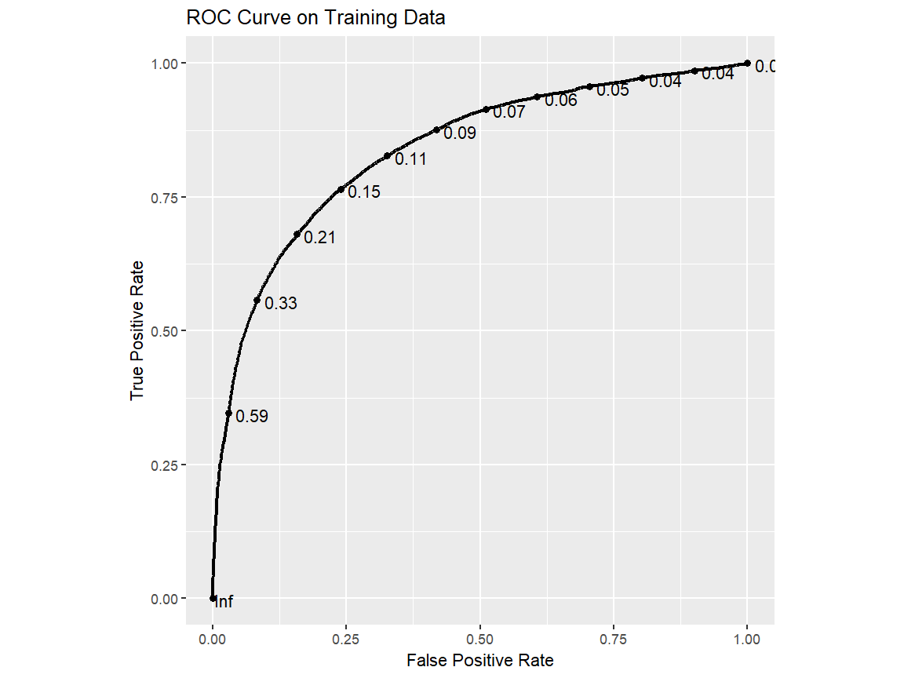

Our cross-validation shows us the value of the Lasso's penalty 
factor, $\lambda$, that maximized AUC across the 5-fold test sets: 
5.0118723\times 10^{-5}. The AUC this tuning parameter value 
produced was 0. The ROC
curve generated from this model during cross-validation is visualized
above.

So, with this cross-validation, we have tuned $\lambda$ and fitted
our model. Now, we just need to estimate our accuracies on the 
out-of-sample test set.

## Test Set Prediction

### Process Test Data

Just as we processed the training data by removing missing values, adding predictors, and
centering/standardizing features, we will do the same to our test data. It is important to
only use values for mean/mode imputation and standardization that were determined during 
training, as we are trying to mimic our model's performance on true out-of-sample prediction.

We start with adding a missingness indicator and imputating missing values.


```r
#Loop over features to include missing indicators for
for(feature in miss.ind.features){
  
  #Create and attach indicator of missing value
  test_data[, paste("miss",feature,sep="")] <- as.factor(
                                                ifelse(
                                                  complete.cases(test_data[,feature]),
                                                         0,
                                                         1))
  
}#End loop over features 

#Impute missing values (using values from train set)
#Loop over all features
for(feature in colnames(test_data)){
  
  #If feature is a factor variable
  if(class(test_data[,feature]) == "factor"){
    
    #Impute the mode for missing values
    test_data[is.na(test_data[,feature]) ,feature] <- Mode(train_data[,feature])
    
  }#End if conditional 
  
  else{
    
    #If non-factor, impute the mean
    test_data[is.na(test_data[,feature]) ,feature] <- mean(train_data[,feature], 
                                                            na.rm = T)
    
  }#End else conditional
  
}#End loop over features

#Check if any NAs left
summary(test_data)
```

```
 dropout  male                      race_ethnicity scale_score_8_math
 0:8619   0:5021   African-American        :1293   Min.   : 0.00     
 1:1969   1:5567   Asian/Pacific Islander  : 134   1st Qu.:30.00     
                   Hispanic                : 347   Median :41.32     
                   Multiple/Native American: 175   Mean   :41.49     
                   White                   :8639   3rd Qu.:54.00     
                                                   Max.   :80.00     
 scale_score_8_read gifted_11 ever_alt_sch_11 sped_11  pct_absent_11  
 Min.   : 0.00      0:8566    0:7740          0:9396   Min.   :0.000  
 1st Qu.:39.00      1:2022    1:2848          1:1192   1st Qu.:1.330  
 Median :47.43                                         Median :1.563  
 Mean   :47.52                                         Mean   :1.545  
 3rd Qu.:56.00                                         3rd Qu.:1.807  
 Max.   :80.00                                         Max.   :3.084  
   cum_gpa_11     frpl_11  lep_11    missscale_score_8_math
 Min.   : 0.000   0:4191   0:10423   0:8794                
 1st Qu.: 4.307   1:6397   1:  165   1:1794                
 Median : 7.475                                            
 Mean   : 7.706                                            
 3rd Qu.:10.923                                            
 Max.   :16.000                                            
 missscale_score_8_read misspct_absent_11 misscum_gpa_11
 0:8825                 0:10575           0:10335       
 1:1763                 1:   13           1:  253       
                                                        
                                                        
                                                        
                                                        
```

Now we can add polynomial predictors.


```r
#Store factor variables as factor in data
#Loop over feature names
for(variable in c("scale_score_8_math","scale_score_8_read","pct_absent_11","cum_gpa_11")){
  
  #Create new column with feature raised to certain power in test set
  test_data[, paste(variable,"^2",sep="")] <- test_data[, variable]^2
  test_data[, paste(variable,"^3",sep="")] <- test_data[, variable]^3
  
}# End loop over feature names
```

Now we can center and standardize.


```r
#Centers and scales our testing numberic data (based on train data)
test_data_s <- predict(processor, test_data)
```

### Making Predictions

Finally, we make our predictions on the test data. We will generate our final ROC curve
to evaluate our out-of-sample performance at various cutpoints. 


```r
#Predicts probabilities of dropping out on test data
pred.probs <- predict(model.ROC, newdata = test_data_s[, -1], type = "prob")

#Stores actual test data outcomes (and re-level)
observed <- test_data_s[, "dropout"]
levels(observed) <- c("X0","X1")

#Make into dataframe fro plotting
ROC.plot.frame <- data.frame(X1 = pred.probs$X1,
                             obs = factor(observed, levels = c("X0","X1")))

#Plot ROC curve for test set
ggplot(ROC.plot.frame, 
        aes(m = X1, d = obs))+ 
        geom_roc(hjust = -0.4, 
                 vjust = 1.5, 
                 n.cuts = 13,
                 labelround = 2)+ 
        coord_equal()+
        ylab("True Positive Rate")+
        xlab("False Positive Rate")+
        ggtitle("ROC Curve on Test Data")
```

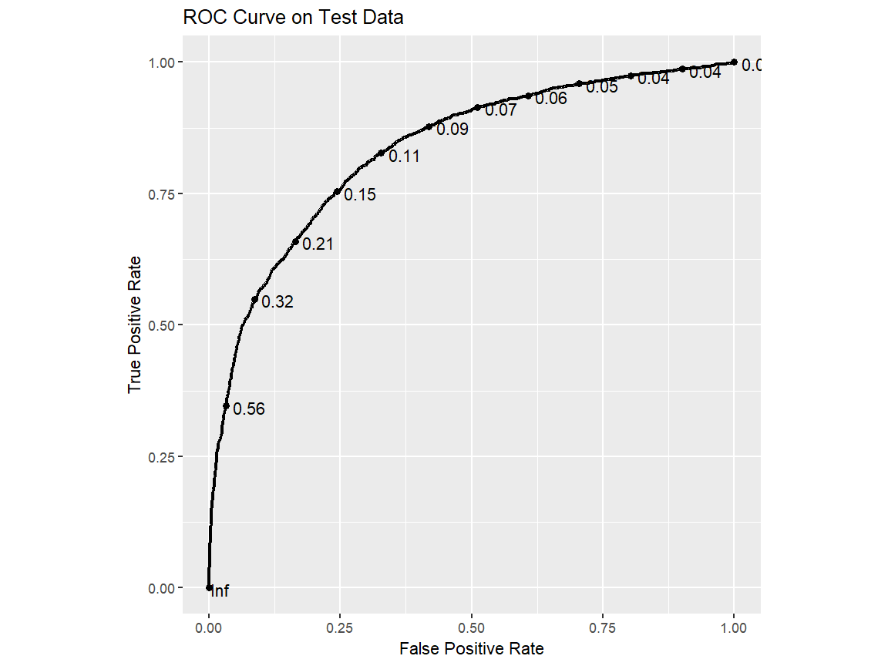

```r
##Can use this code to get predicts after determine final cutpoint
#cut <- 

#predicted <- ifelse(pred.probs > cut, 1, 0) #Uses determined cutpoint to make predictions

##Overall accuracy
#print('Overall test set accuracy')
#mean(predicted == observed)
#
##Accuracy for non-dropouts
#print('Accuracy for non-dropouts')
#mean(predicted[observed==0] == observed[observed==0])
#
##Accuracy for dropouts
#print('Accuracy for dropouts')
#mean(predicted[observed==1] == observed[observed==1])
```

As expected, this ROC curve will have a slightly worse AUC than the ROC 
produced during training--even with taking measures to prevent overfitting,
models generally will do better on training data than testing data. So, we
now have a good set of estimates of different accuracy rates at various 
cutpoints for new, out-of-sample data.

### Determining a Cutpoint

The last step is determining an optimal cutpoint. To determine a cutpoint, 
the context of the problem is key. In the case of predicting dropouts, 
most districts would probably value maximizing true positives over 
minimizing false negatives. In other words, districts would err on the 
side of overpredicting dropouts, rather than err on the side of
underpredicting them.

If the goal is to minimzie the number of dropouts, giving a dropout 
intervention to a non-dropout student (a false positive) has far fewer 
costs than failing to provide interventions to a student who would 
otherwise drop out (a false negative). In addition, a student who 
receives a drop out intervention will most likely benefit from that 
intervention, regardless of whether or not they would have dropped 
out without it. By contrast,a student who fails to receive a dropout 
intervention and drops out of school will likely face great hardships 
because of it. Therefore, if our model will be biased either towards 
predicting more dropouts than there actually are or predicting fewer 
dropouts than there actually are, we'd want it to over-predict dropouts. 

However, false positives have costs. It'd be impossible to give costly
interventions to all students. A data scienstist would need to meet with
policymakers and stakeholders to collectively decide the cutpoint at which
the district would be comfortable providing dropout intervention services.

To inform this discussion, it's often helpful to frame the problem in terms
of raw numbers, rather than probabilites. For example, say you work in a district 
of 1,000 rising 9th graders. The data shows that 19% of rising 9th graders in the 
district drop out. Imagine that for your model, the cutpoint of 10% yielded a 75% 
true positive rate and 25% false positive rate on the test set. You can present 
to stakeholders the following:

"In our district, typically 19% of rising 9th graders eventually drop out of high
school. So, among our 1,000 current rising 9th graders, we'd expect $0.19 * 1,000 = 190$
to drop out. My model tells us the probability that a certain rising 9th grader will
drop out. Our task is to decide when this probability gets high enough that we start
giving an intervention. 

If we decide that we should give interventions to students with a probability of dropping
out of 10% or higher, that would mean that about $0.75 * 190 = 143$ of the 190 future 
dropouts would receive the intervention. In addition, of the 810 non-dropouts, about
$0.25 * 810 = 203$ of them would receive the intervention. So, in total, we'd have about
346 students receiving the dropout intervention.

If we raise the probabily threshold above 10%, we'd reduce costs by giving the intervention
to less students. But we'd also catch fewer future dropouts with the intervention."

Using the same calculations above, the data scientist can give multiple numerical estimates
for different cutpoints to district leaders. Finally, a decision would be made. And, just
like that, you now have a finely tuned model to predict future dropouts!
