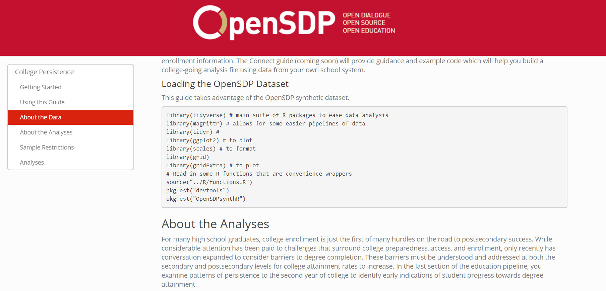
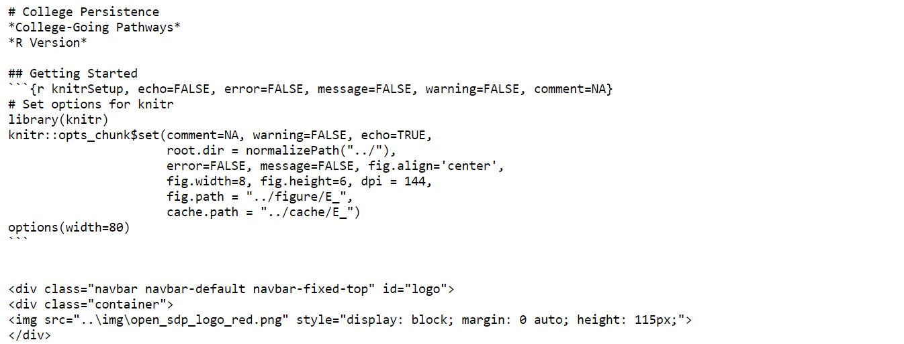
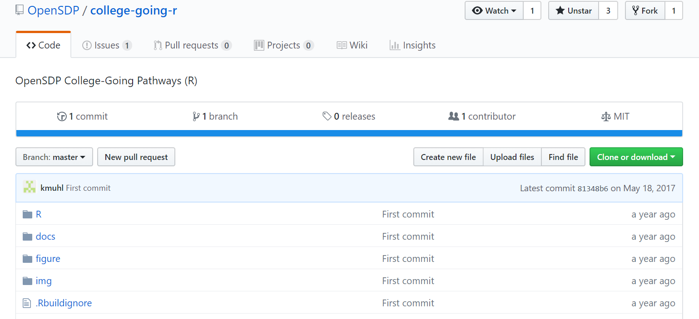
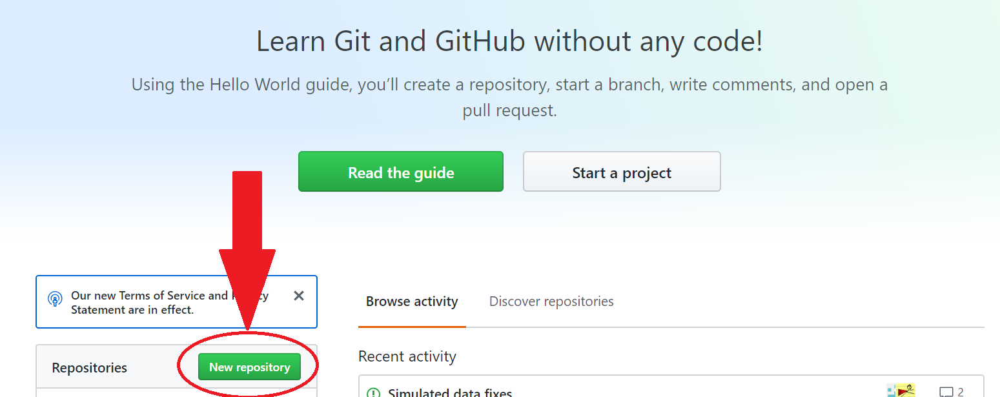
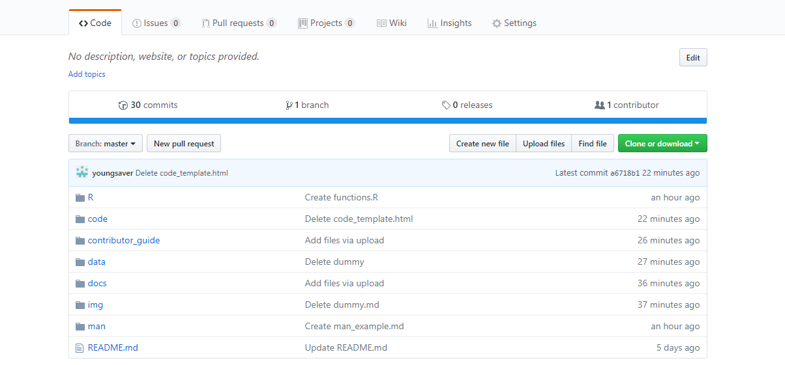
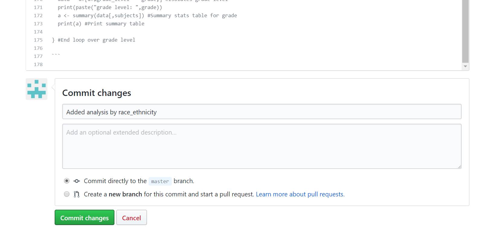

## Getting Started
The best way to get started contributing to OpenSDP is to explore model analyses
on the OpenSDP website. We recommend checking out the "College Persistence"
analyis in the R programming language on the OpenSDP Analysis page, here:
https://opensdp.github.io/analysis/.

Within the OpenSDP Analysis page, the "College Persistence" analyis section will
look like this:

 

 

Click "View Guide." The guide (displayed below) is the final product: an
organized HTML page that explains the purpose behind the analysis, contains
example code with comments, and displays final visual and summary outputs of the
data. The intention is to make the analysis clear and accessible.

 

 

Go back to the "College Persistence" section of the OpenSDP Analysis page
(https://opensdp.github.io/analysis/) and click on "Download Code." The page
that opens (displayed below) is the plain text version of the R Markdown code
that generated the analysis guide. Data managers who use code from OpenSDP can
easily copy and paste from these pages to get the code they need, without having
to explore repositories on the back end. Or, if prefferred, they could simply
copy and paste from the code chunks within the guide HTML page.

 

 

One last time, go back to the "College Persistence" section of the OpenSDP
analysis page. Click on "Go to Repository." The page that opens (displayed
below) is the GitHub "back end" to the analyis guide. The repository houses the
data, functions, code, and all other materials needed to produce the guide.
GitHub is a platform that allows for sharing and collaborating with open-source
code. If you want to contribute to OpenSDP, you will have to get comfortable
uploading the materials to GitHub. We have instructions below to get you started
with GitHub and, if you're already familiar with using GitHub, to get you
started with formatting your repositories in the OpenSDP style.

 

 

## Using GitHub for OpenSDP
GitHub is a platform that allows OpenSDP contributors to share their code,
collaborate with peers, and produce useful output for others to use. Here, we
take you through the steps of initializing your work with OpenSDP's GitHub
guidelines so that you can contribute to OpenSDP openly and effectively.

### Step 1 (if applicable): Create GitHub account
If you are new to GitHub, you can create an account here:
https://github.com/join.

### Step 2: Create, name, and initialize a new GitHub repository
Repositories in GitHub are (essentially) online folders of your work that allow
others to see and use your code, files, and analyses. Once you have created your
account (or if you already had an account):

- Go to the home page of your GitHub profile
- Click on "New repository"

 

 

This will open a page that allows you to name your repository and control its
privacy settings. Please follow these guidelines:

- Please keep the name short and separate words with an underscore. For example,
one repository name may be: `opensdp_grad_rate_analysis`.

- Make sure the repository is set to "Public." In the interest of transparency
  and usability, OpenSDP is committed to making resources that are open-source.
  Since the repository will be made public, please do not share sensitive
  information within your code or supporting documents, particularly private
  student data.

- Do **NOT** check the box "Initialize this repository with a README." The
  repository will eventually have a README file, but that will come later in the
  process.

Next, you will import the OpenSDP starter pack, which contains basic OpenSDP
files that are present in all OpenSDP R projects and analyses. These files will
allow you to authentically mimic the OpenSDP methods, functions, outputs, and
styles in your analyses.

- Click the "import code" option at the bottom of the page
- Copy and paste this URL (https://github.com/youngsaver/OpenSDP_starter_pack)
into the space provided for URLs
- Click "Begin import."

GitHub will email you a link to see the finished product once the import has
finished. Your new repository, after importing, should look like this:

 

 

### Step 3: Download a local copy of OpenSDP starter files
Now, after importing the OpenSDP starter pack, your repository contains the
introductory style documents, coding templates, and folder structure to start
contributing to OpenSDP. The next step is to create a copy of these files on
your computer, so you can use and modify them when creating (or adapting them
to) your analysis.

- In the upper right corner of all the folders in the repository, click the
green "Clone or download" button
- In the drop down menu, click "download ZIP"
- Extract this zip folder to your computer

## Guide to folders and files
The OpenSDP starter pack contains several folders, each with at least one file.
As you see fit, feel free to add extra folders to your repositry, add files to
existing folders, and/or edit the starter files. However, "less is more" in this
context, as a simple folder and file structure will allow others to follow your
project more easily. Please, also, do not delete any starter pack files or
folders completely: we would like all OpenSDP repositories to maintain the
starter pack's basic structure.

The following is a guide that explains the purpose behind each folder and file
in the OpenSDP starter pack.

### Folder: `R`
**Purpose:** Houses implementation of functions or other user-generated R tools
that are utilized in the main analysis code. Keeping this information in a
separate folder reduces clutter in the main code and allows collaborators to
see these tools in isolation.

Contains the following file(s):

- `functions.R`
    - **File type:** R script
    - **Description:** Contains code for all user-generated functions called in the main code.
    - **Guide for use:** The file already contains several OpenSDP-created functions
  commonly used in previous analyses. If applicable, please add your own
  user-generated functions (that are called in your main analysis code) to this
  script file. Please do not delete the OpenSDP functions already provided (even
  if they are not used in your main code).

### Folder: `code`
**Purpose:** Houses the main R markdown code of the analysis.

Contains the following file(s):

- `code_template.Rmd`
    - **File type:** R markdown
    - **Description:** Contains code, descriptions, and summaries that render the
- final HTML analysis guide page, as displayed on OpenSDP's webiste.
    - **Guide for use:**
        - The R markdown code should follow a specific structure in terms of formatting
  descriptions, code chunks, headings, and attributions, so make sure to follow
  the template in the file.
        - Every chunk of code should be accompanied by concise description of its
  purpose and outcome. Specific descriptive components designed for the user to
  modify are marked by asterisks (rendered as bold print in markdown). For
  example, under "Objective," the template has: `In this guide, you will be able
  to...**explain objective here**`. The user is expected to write the objective
  in the space marked by `**explain objective here**`.
        - A coding style guide can be found in the `contributor_guide` folder.
        - The file must be R markdown. If you are new to using R markdown, don't fret:
  the coding functionality and syntax is essentially the same as it is in a
  normal R script. R markdown just contains extra functionality that allows you
  to put text and images alongisde your code and render it as an HTML, making it
  more user-friendly for our site's visitors. Here is a useful guide to using R
  markdown: https://bookdown.org/yihui/rmarkdown/basics.html.

### Folder: `contributor_guide`
**Purpose:** Houses this guide in addition to general coding style and data
naming guides.

Contains the following file(s):

- `contributor_guide.md`
    - **File type:** Markdown
    - **Description:** Provides steps and considerations for contributing analyses to OpenSDP.

 

- `sdp_coding_style_guide.pdf`
    - **File type:** PDF
    - **Description:** Guidelines for styling code in OpenSDP analyses,
      including recommendations for indentation, comments, avoiding hard coding,
      and more.
    - **Guide for use:** Currently, the guide is written for Stata users. However,
  the majority of the techniques described can be translated directly into R
  code. See `code_template.Rmd` for brief examples of model R coding technique
  or take a look at previously written code from other analyses on the OpenSDP
  website.

 

- `sdp_data_specification_guide.pdf`
    - **File type:** PDF
    - **Description:** Guidelines for naming variables, cleaning data, and organizing data files.
    - **Guide for use:** This guide is comprehensive and prepared for Strategic Data
  Project Fellows. Likely, you will not have to use most of the information.
  However, the conventions for naming dataset features are particularly
  important and should be mimicked in your dataset and code.

 

- Subfolder: `img`
    - **Description:** Contains images used in `contributor_guide.md`.

### Folder: `data`
**Purpose:** Houses data used in the main analysis code.

Contains the following file(s):

- `start_data.csv`
    - **File type:** comma-separated value file
    - **Description:** Model dataset used in example code.
    - **Guide for use:** Data should be in either `.csv` or `.RData` formats. Use
  data feature naming conventions as expressed in
  `sdp_data_specification_guide.pdf`. The data in this file were created using
  OpenSDP's data simulator and, therefore, do not compromise any FERPA-protected
  student information. As OpenSDP is an open-source site, no private student
  data should be uploaded here or anywhere in your analysis.

### Folder: `docs`
**Purpose:** Houses OpenSDP styling documents.

Contains the following file(s):

- `styles.css`
    - **File type:** cascading style sheet
    - **Description:** Contains formatting for OpenSDP logo and background in the analysis guide HTML page.
    - **Guide for use:** As long as this file name does not change and the styling
  information from the template provided in `code_template.Rmd` remains
  unaltered, the styles should automatically render when you knit the HTML of
  your R markdown code.

 

- `toc.css`
    - **File type:** cascading style sheet
    - **Description:** Contains formatting for table of contents in the analysis guide HTML page.
    - **Guide for use:** As long as this file name does not change and the styling
  information from the template provided in `code_template.Rmd` remains
  unaltered, the styles should automatically render when you knit the HTML of
  your R markdown code.

### Folder: `img`
**Purpose:** Houses images, both author-provided and OpenSDP-provided, used in
the analysis guide.

Contains the following file(s):

- `open_sdp_logo_red.png`
    - **File type:** portable network graphic (PNG image file)
    - **Description:** OpenSDP logo that displays at the top of the analysis guide.
    - **Guide for use:** All OpenSDP analysis guides must contain this logo. As
      long as this file name does not change and the styling information from
      the template provided in `code_template.Rmd` remains unaltered, the logo
      should be correctly formatted when you knit the HTML of your R markdown
      code.

### Folder: `man`
**Purpose:** Houses descriptive background information of data files and
analysis. All files should be in markdown format.

Contains the following file(s):

- `data_description.md`
    - **File type:** markdown
    - **Description:** Provides type, range, and meaning for each data feature.

### File: `README.md`
- **Description:** Provides an overall description of the GitHub repository and
your analysis. Provides attribution and usage information.
- **File type:** markdown
- **Guide for usage**: Provide a brief description of the purpose of your
  analysis in place of "Inser goal of analysis here." Add attribution
  information for collaborators on the project or for any
  individual/organization that provided support for the project in any way.

## Updating GitHub
When working with the above files on your computer locally, it is a good
practice to periodically update the corresponding files in the GitHub
repository. Doing so allows collaborators to see your progress and edits. In
addition, GitHub allows you to compare previous file versions with updated file
versions, line by line. This is particularly useful with respect to code files.

There are multiple ways to update files in GitHub, some more complicated than
others. Here, we show simple ways to update two broad types of files:

### Updating native GitHub files
Some files, especially code files, are rendered natively in GitHub. This is true
of css, markdown, and Rmarkdown documents. To update such files, use a simple
copy and paste method:

- Click on the file name in GitHub
- Click the pencil symbol in the upper right corner to edit the file
- Click in the box containing the text of the document/code and select all by hitting `Ctrl`+`A`
- Press `Delete`. It feels scary, but do not worry: GitHub will save a copy of this file version
- Now go to your up-to-date local copy of the file. Copy all your code from your local copy of the file
- Paste your code into the (now) empty text box on GitHub
- Scroll down to the "Commit changes" section. Provide a very brief description of what updates were made
- Click the green button labeled "Commit changes"

 

 

Your updates have now been saved. At any time, you can click on that updated
file in GitHub and see those updates rendered natively. Next to the editing
pencil tool on the file page, you will also see a `History` button. This shows
the edits made to document during each update, line-by-line. Red indicates lines
or expressions that were cut, and green indicates added material.

### Updating non-native GitHub files
Many files do not render natively on GitHub, including HTML, CSV, PNG, Word, and
many others. GitHub will not track changes to these files in updates. Instead,
to update such files, you will have to delete and replace:

- Click on the file name in GitHub
- Click the trash can symbol in the upper right corner
- Confirm the deletion by clicking "Commit changes"
- Navigate back into the repository folder that contained the (just-deleted) file
- Click the "Upload files" button in the top right corner
- Drag your updated file to the box (or find via "choose your files")
- Click "Commit changes"

### Uploading new files
To upload a new file to one of your GitHub repository folders:

- Find the repository folder into which you would like to upload the new file and click into it
- Click the "Upload files" button in the top right corner
- Drag the new file to the box (or find via "choose your files")
- Click "Commit changes"

While uploading a new file to a folder that already exists in your repository is
fairly simple, creating a new folder in GitHub and uploading a new file to that
folder can be suprisingly tricky (GitHub does not allow for the creation of new
blank folders):

To upload a new **code or markdown** file to a new folder:

- Navigate to the main page of the repository
- Click the "Upload files" button in the top right corner
- After the `/` in the path name, type the name of the new **folder**
- Type another `/`
- Type the name of the file you would like to add (file extension included)
- Paste the body of the code file into the code text box
- Click "Commit new file" at the bottom

To upload a new **non-code** file to a new folder:

- Navigate to the main page of the repository
- Click the "Upload files" button in the top right corner
- After the `/` in the path name, type the name of the new **folder**
- Type another `/`
- Type `foo`. This will be a dummy file that we will delete in a moment
- Click "Commit new file" at the bottom
- Now you are in the folder you just created with the blank `foo` file. Click
"Upload files" at the top right corner
- Upload the new file and commit the new file.
- Navigate back into the folder you created and delete the `foo` file.

## Collaborating on GitHub
GitHub's main function is to allow effective collaboration between coders. It
has various tools geared towards this purpose. To get a sense of these tools at
large, visit GitHub's flow guide: https://guides.github.com/introduction/flow/.
In particular, the flow guide provides an introduction to using branches and
pulls, which are some of the most effectives functions for collaboration in
GitHub.

The flow guide is the best resource to get you started with higher-level GitHub
collaboration techniques. Here, instead, we will walk you through a couple of
more basic collaboration steps:

### Adding collaborators
To invite collaborators to your GitHub repository...

- Navigating to your repository's main page
- Click on "Settings"
- Click on "Collaborators"
- Add names of potential collaborators

### Flagging issues
To track code fixes and improvements, it is useful to open issues. Issues create
a running "checklist" of action steps needed to finalize or fix your code. They
also allow collaborators to comment on progress or barriers to resolving those
issues. To create an issue...

- Navigate to your repository's main page
- Click on "Issues"
- Click on "New issue"
- Title, write, and submit issue

Issues can be commented on, edited, updated, and closed as progress is made.

## Submit analysis to OpenSDP
Once you have finalized your code (as well as supporting documents and
repository structure), send an email to `sdp@gse.harvard.edu` to get your
contribution reviewed and, eventually, uploaded to the OpenSDP website. Keep in
mind that because OpenSDP is committed to open-source code and transparency,
your entire repository will be shared publicly. Please make sure there is no
sensitive information, particularly private student data, in your submission.
